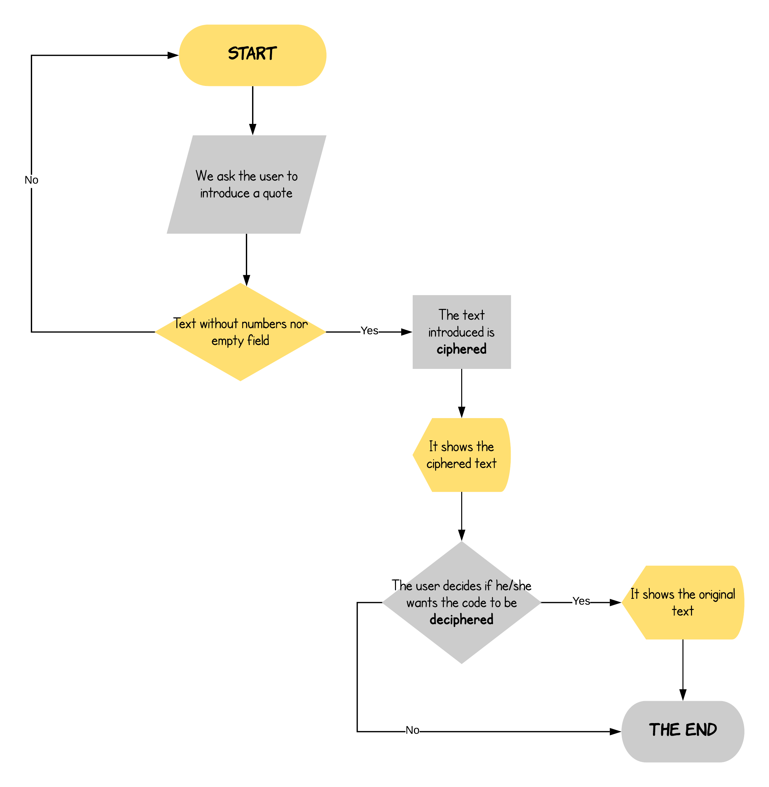

# CAESAR CIPHER

### Descripción: 

Crea una web que pida, por medio de un prompt(), una frase al usuario y devuelva el mismo mensaje encriptado según el algoritmo de Cifrado César con el parámetro de desplazamiento de 33 espacios hacia la derecha

Por ejemplo:

Texto original: ABCDEFGHIJKLMNOPQRSTUVWXYZ
Texto codificado: HIJKLMNOPQRSTUVWXYZABCDEFG

Consideraciones Específicas

Tu programa debe ser capaz de cifrar y descifrar tanto letras mayúsculas como minúsculas. La fórmula para descifrar es: (x - n) % 26.
Tu código debe estar compuesto por 2 funciones con los siguientes nombres: cipher y decipher.
El usuario no debe poder ingresar un campo vacío o que contenga números.

## Pseudocódigo:
### Descripción:
En esta parte se describe la funcionalidad del proyecto descrito en pasos. 

1.  Pedir al usuario que ingrese una frase por medio de un prompt().

2. Verificar que el texto no contenga números ni campo vacío. De lo contrario regresar al punto uno.

3. Crear la función para cifrar el texto introducido.

4. Mostrar al usuario el texto cifrado por medio del cifrado César. Este debe cumplir con ciertos requerimientos.
* Debe reconocer mayúsculas y minúsculas.
* Debe recorrer 33 espacios hacia la derecha.
* Debe devolver el mensaje cifrado.

5. Preguntar al usuario si quiere que su texto sea decifrado. 

6. Si el usuario accede, entonces se decifrará el texto volviéndolo a su forma original. De lo contrario se terminará el proceso.

7. Se mostrará el texto decifrado y así concluirá el proceso.

## Diagrama de flujo:

